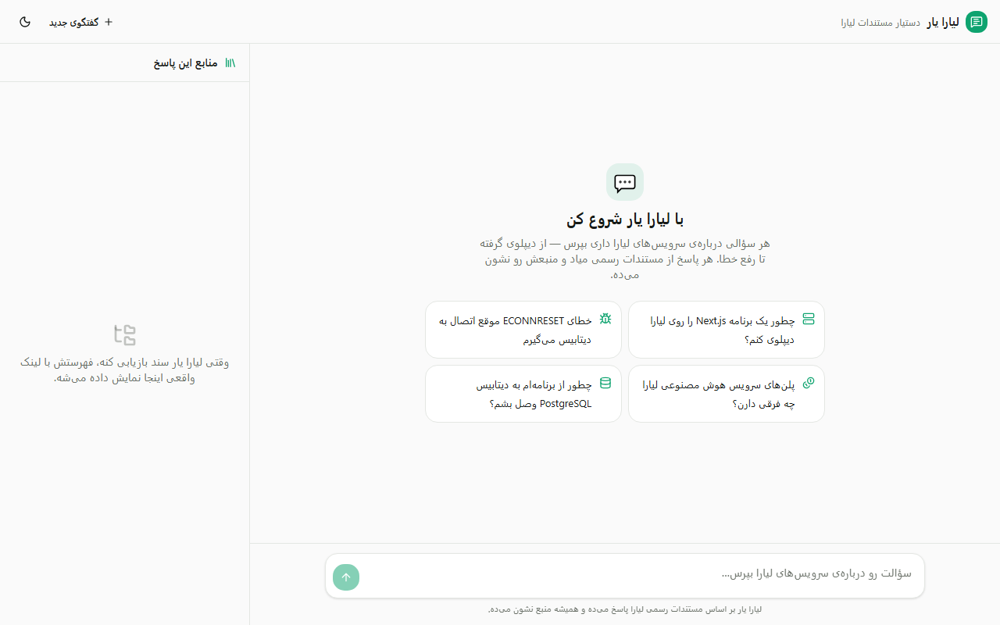
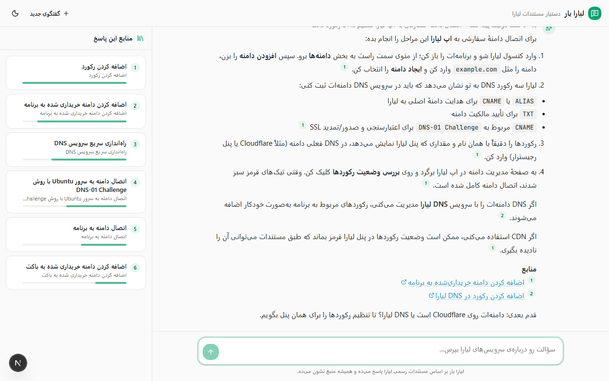
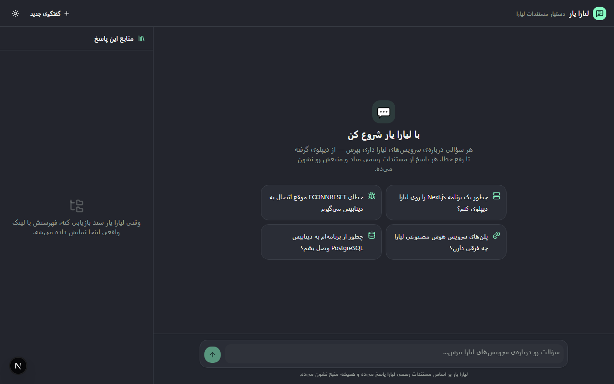
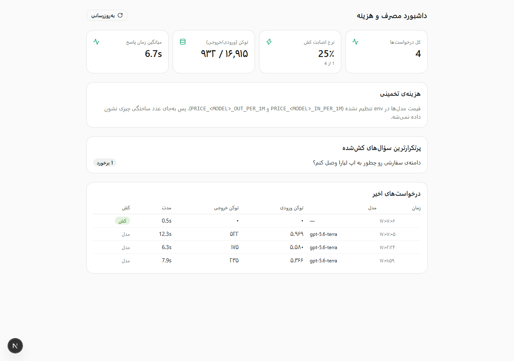

# لیارا یار

دستیار agentic برای مستندات لیارا — چالش ۱ هکاتون Vibe Coding (استارکوچ × لیارا).

به‌جای یک جعبه‌ی جستجوی معمولی، سؤال کاربر رو می‌گیره، در ۱۱۴۲ سند رسمی
`docs.liara.ir` جستجوی هیبرید (BM25 + برداری) انجام می‌ده، وقتی سؤال مبهمه
جای حدس‌زدن سؤال تکمیلی می‌پرسه، از روی لاگ خطای واقعی عیب‌یابی می‌کنه، و هر
جمله‌ی پاسخ رو با ارجاع به URL واقعی مستندات نشون می‌ده — نه فقط لینک تحویل
می‌ده، بلکه کار عیب‌یابی رو تا حد ممکن خودش انجام می‌ده.

> 🔗 **دمو زنده:** _(بعد از دیپلوی روی لیارا اینجا اضافه می‌شه)_
> 🎥 **ویدیوی دمو:** _(اینجا اضافه می‌شه)_

## چرا این‌جوری طراحی شد

لیارا صورت‌مسئله رو «جستجوی بهتر در مستندات» گذاشته. ولی یک کاربر که تایپ
می‌کنه «دیپلویم ارور خورد» یک کوئری جستجو نداره — یک **لاگ** و یک **هدف**
داره. جزئیات کامل تحلیل مسئله، کاربر هدف، و نقشه‌ی معیار داوری → قابلیت در
[`docs/PROJECT.md`](./docs/PROJECT.md).

## اسکرین‌شات

| حالت خالی | یک مکالمه‌ی واقعی |
|---|---|
|  |  |

| دارک‌مود | داشبورد `/admin` |
|---|---|
|  |  |

## قابلیت‌های agentic

مدل به‌جای یک پاسخ تک‌مرحله‌ای، تا ۶ گام می‌تونه از ابزارهای زیر استفاده کنه
(`lib/ai/tools.ts`):

| ابزار | کار |
|---|---|
| `searchDocs` | بازیابی هیبرید (BM25 + برداری + RRF) با فیلتر اختیاری سرویس/پلتفرم |
| `askClarification` | وقتی intent مبهمه، به‌جای حدس، سؤال تکمیلی + گزینه می‌پرسه (UI مکث می‌کنه تا کاربر انتخاب کنه) |
| `diagnoseError` | لاگ خطا/build log می‌گیره، کد خطا رو تشخیص می‌ده، سند منطبق رو پیدا می‌کنه |
| `generateConfig` | `liara.json` / Dockerfile متناسب با استک کاربر می‌سازه |
| `buildRunbook` | راهنمای گام‌به‌گام چک‌باکس‌دار |
| `draftSupportTicket` | وقتی مطمئن نیست، به‌جای توهم‌زدن، پیش‌نویس تیکت با خلاصه‌ی گفتگو می‌سازه (صریحاً «ثبت نشده» — کاربر خودش می‌فرسته) |

پروفایل کاربر (پلتفرم، سرویس در حال استفاده) از خود مکالمه استخراج و در
`localStorage` نگه‌داری می‌شه و به رتبه‌بندی بازیابی و system prompt تزریق
می‌شه — بدون نیاز به لاگین.

## بازیابی

- کورپوس: هر ۱۱۴۲ سند رسمی از `docs.liara.ir/all-links-llms.txt`، به ۲۳۵۸
  تکه شکسته شده (`scripts/ingest.ts`)
- **BM25** با نرمال‌سازی فارسی (یکسان‌سازی حروف عربی/فارسی، ارقام، نیم‌فاصله،
  اعراب) + یک دیکشنری هم‌معنی دستی — کشف شد که «دیپلوی» در **صفر** سند وجود
  داره چون مستندات «استقرار» می‌نویسه؛ بدون این نگاشت، رایج‌ترین سؤال ممکن
  هیچ نتیجه‌ای نمی‌داد
- **جستجوی برداری** (`text-embedding-3-small`) روی ایندکس استاتیک کامیت‌شده
  در ریپو (نه دیتابیس — کورپوس ۵.۴ مگابایته، دلیل کامل در ADR-003)
- ادغام با **Reciprocal Rank Fusion** + سقف تنوع منبع (حداکثر ۲ تکه از هر URL)
- هر پاسخ با ارجاع درون‌متنی شماره‌دار [۱] به سند و URL واقعی
- سنجیده شده، نه فقط ادعا: `npx tsx scripts/eval.ts` روی ۳۴ سؤال طلایی
  (از URLهای واقعی کورپوس) **recall@5 = 85.3%** می‌ده — روی بدترین حالت
  ممکن (بدون فیلتر سرویس/پلتفرم؛ در اپ واقعی profile کاربر این عدد رو
  بهتر می‌کنه). تحلیل خطاها در `PROGRESS.md`.

## امنیت، مانیتورینگ، بهینه‌سازی هزینه

- **Rate limiting** کشویی per-IP، قبل از parse شدن بدنه‌ی درخواست (تست شده
  با یک burst واقعی ۱۵تایی — دقیقاً ۴۲۹ سر درخواست ۱۳ام)
- **zod** روی تمام ورودی API، کلید AI فقط سمت سرور، بدون نشت stack trace
  به کلاینت
- **لاگ ساخت‌یافته‌ی JSON** با request ID و مصرف توکن هر درخواست
- **کش معنایی** برای سؤال‌های تکراری (اولین پیام یک مکالمه، بدون پروفایل) —
  با پروتکل رسمی AI SDK بازپخش می‌شه، نه یک فرمت دست‌ساز. آستانه‌ی cosine
  عمداً محافظه‌کارانه (۰.۹۷) انتخاب شده؛ چرا و با چه اندازه‌گیری واقعی، در
  [ADR-008](./docs/DECISIONS.md) مستنده
- **مدل دوسطحی**: مدل قوی فقط برای پاسخ نهایی، سقف توکن هر درخواست
- **داشبورد `/admin`** (پشت `ADMIN_TOKEN`): تعداد درخواست، نرخ اصابت کش،
  توکن مصرفی، جدول درخواست‌های اخیر. هزینه‌ی تخمینی فقط وقتی نشون داده
  می‌شه که قیمت واقعی مدل در env تنظیم شده باشه — به‌جای یک عدد ساختگی

## استک

Next.js 16 (App Router) + TypeScript + Tailwind v4 + shadcn/ui (RTL) ·
Vercel AI SDK v6 + `@ai-sdk/openai` (سازگار با هر gateway سازگار با OpenAI،
فعلاً [AvalAI](https://avalai.ir)) · بازیابی هیبرید دست‌نویس (بدون
دیتابیس برداری) · فونت Vazirmatn (SIL OFL). چرا هر کدوم، در
[`docs/DECISIONS.md`](./docs/DECISIONS.md) (ADR-001 تا ADR-008).

## اجرای محلی

```bash
npm install
cp .env.example .env.local   # BASE_URL، AI_API_KEY، و بقیه رو پر کن
npm run dev
```

برای ساخت دوباره‌ی ایندکس بازیابی (به‌ندرت لازمه — ایندکس از قبل کامیت شده):

```bash
npx tsx scripts/ingest.ts
```

## Definition of Done — سناریوهای دمو

این پنج سناریو بدون دست‌کاری روی همین اپ اجرا می‌شن (جزئیات در
[`docs/PROJECT.md`](./docs/PROJECT.md#۴-definition-of-done-برای-دمو)):

1. سؤال ساده → پاسخ مرحله‌به‌مرحله با لینک به سند واقعی
2. سؤال مبهم («دیتابیسم وصل نمی‌شه») → سؤال تکمیلی، نه حدس
3. پیست کردن یک لاگ خطای واقعی → تشخیص خطا + راه‌حل مستند
4. پیگیری context («حالا همین رو برای Laravel بگو») → پاسخ بازنویسی‌شده برای استک جدید
5. سؤالی که مستندات جوابش رو نداره → توهم نمی‌زنه، پیش‌نویس تیکت می‌سازه

## محدودیت‌های شناخته‌شده (صادقانه)

- ایندکس بازیابی استاتیکه؛ به‌روزرسانی مستندات لیارا نیاز به اجرای دوباره‌ی
  `ingest.ts` و کامیت داره — برای این حجم کورپوس منطقیه، ولی در مقیاس واقعی
  باید به یک cron یا pgvector مهاجرت کنه (ADR-003)
- کش معنایی فقط تکرار تقریباً دقیق سؤال رو می‌گیره، نه بازنویسی آزاد —
  چرا در ADR-008
- حافظه‌ی مدل فقط در طول یک مکالمه‌ست (تاریخچه‌ی همون تب/session)؛ هیچ
  دیتابیس یا لاگینی برای نگه‌داشتن مکالمه بین جلسات وجود نداره — تصمیم
  آگاهانه، نه محدودیت فنی (بخش «Explicitly Cut» در `docs/PROJECT.md`)

## تیم

آتیلا — معماری، توسعه، UI/UX. بخشی از [هکاتون Vibe Coding استارکوچ](../README.md)
(سه چالش مستقل، هر کدوم ریپوی خودش).
